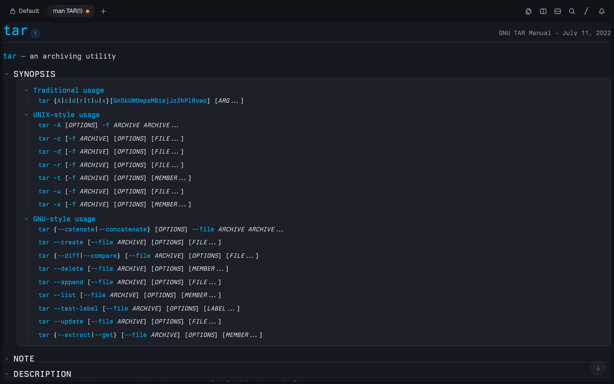

# mantern

`mantern` is a small Rust man page viewer for the [Tern](https://docs.stencil.so/tern/) terminal. 



## What it is

`mantern` is a drop-in `man` replacement. When you run `mantern tar`, instead of showing the page in a pager, it draws a title block, a synopsis card, option cards with highlighted flags, code blocks, lists, and tables as terminal UI. Long pages start with some sections folded so you can expand just the parts you care about.

It uses the Tern Surface Protocol (TSP) to draw this UI directly in the terminal, with no terminal plugin needed. If something goes wrong or you ask for something it can't handle, it falls back to the system `man`.

## Build and install

You can build it on a Unix system with Rust 1.88 or later, a C compiler (for the vendored mandoc sources), the zlib, xz (liblzma) and bzip2 libraries, and the system `man` installed:

```sh
cargo build --release
```

That gives you `target/release/mantern`. Copy it somewhere on your `PATH`, for example:

```sh
mkdir -p ~/.local/bin
install -m755 target/release/mantern ~/.local/bin/mantern
```

To get the rendering shown in the screenshot, your terminal needs to support TSP `flow` and `styles`. Without `styles`, `mantern` will still send the page, just without its stylesheet. Tern 0.4.5 supports both features; Tern 0.4.1 does not support this native mode. `mantern` checks what features the terminal advertises rather than checking the version number.

If you want to use it as your `man` command, you can add this alias to your shell configuration (like `~/.zshrc`):

```sh
alias man=mantern
```

Keep the system `man` installed, though. `mantern` searches `PATH` for it and explicitly skips its own executable, so even if you name or link the binary as `man` it won't recurse into itself.

## Usage

```sh
mantern tar
mantern 5 ssh_config
```

Or, if you set the alias, just use `man tar` or `man 5 ssh_config` like normal.

## How it behaves

When you open a long page, `mantern` starts with NAME, SYNOPSIS, and DESCRIPTION expanded and folds the other sections. It estimates the length by looking at how mandoc renders the text at the current terminal width. You can click a section heading to expand or collapse it. If you'd rather have every section expanded by default, set `MANTERN_FOLD=0`.

In SEE ALSO, you can click a manual-page chip to open that page below the current one. The previous page stays in scrollback, but only the newest page handles chip clicks. If it can't find or parse the linked page, it shows a missing-entry message.

If a page has a reference in the text like `printf(3)`, clicking it opens [man.archlinux.org](https://man.archlinux.org/) instead of a local page.

To close the live page and get back to your shell, press `q`, Ctrl-C, or Ctrl-D. The page stays in scrollback.

## When it falls back to the system man

`mantern` will just pass your original arguments to the system `man` when:

- You don't give it a single `NAME` or `SECTION NAME` (for example if you use flags like `-k`, `-f`, or `-w`)
- Standard output isn't a terminal (like if you pipe or redirect it)
- `TMUX`, `STY`, or `ZELLIJ` is set (meaning you're in tmux, screen, or zellij)
- The terminal doesn't answer the TSP handshake or doesn't advertise `flow` support
- `MANTERN=0` is set
- It can't find the initial page, or the page doesn't use `man(7)` or `mdoc(7)`, or parsing or native drawing errors out
- mandoc reports that it dropped part of the page (a source error other than an unknown macro or an `.mso` load, or a truncated tree), or the page is too big or too deep for a Tern surface

If the system `man` isn't available on `PATH`, it will just show an error.

## Limits

- Native mode only accepts one page per invocation, not a list of pages
- It doesn't implement pager-style navigation or search keys yet; you have to use Tern's scrolling and the section headings
- It uses the fallback path in tmux, screen, and zellij, and also for `man`'s flag-based modes
- It doesn't try to fully reproduce roff layout. If there's a construct it doesn't have a native UI for, it just degrades to text

## Environment variables

| Variable | Effect |
| --- | --- |
| `MANTERN=0` | Always use the system `man`. Other values do not disable native mode. |
| `MANTERN_FOLD=0` | Start all sections open, even on long pages. Folding is enabled by default. |
| `MANTERN_DEBUG` | When set to any value, log fallback reasons, the TSP hello reply and received input to stderr. |
| `MANTERN_TSP_RECORD=FILE` | Create or overwrite a JSONL recording of outgoing surface messages for Tern's `surface-play`. If the file cannot be created, recording is skipped. |

## How it works

1. It uses the system `man -w` to find the page you asked for
2. `libmandoc-rs` parses the source into a mandoc AST
3. `src/render.rs` converts that AST into TSP nodes for sections, text, cards, tables, and chips
4. `src/lib.rs` opens a flow surface and attaches `src/style.css` if `styles` is supported
5. The browser handles chip actions and quit keys, then closes the surface while keeping it in scrollback

## Development

`mise.toml` selects Rust 1.90 and defines a corpus task:

```sh
mise install
mise run corpus
```

`examples/corpus.rs` is a development spike that parses pages under the system's `manpath` and reports libmandoc coverage. It also accepts explicit man roots, JSON output, and a single-page AST dump. `examples/surface.rs` writes a page's TSP messages as a replayable recording without a terminal.

## License

mantern is licensed under [GPL-3.0-or-later](LICENSE).

The `libmandoc-rs` dependency bundles vendored mandoc code under its own permissive licenses. Its declared license expression is `Apache-2.0 AND ISC AND BSD-2-Clause AND BSD-3-Clause`; see that crate's license files and third-party notices.